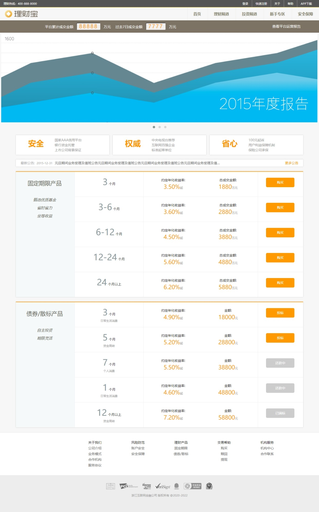

# 理财宝

- 结构：Picturefill.js+rem+em+百分比媒体查询响应式布局

- 截图:ice_cream:

  

- 演示地址:ocean:：https://vogadero.github.io/WealthManagementTreasure/

# Tree🌵    
```
理财宝-Picturefill.js+rem+em+百分比媒体查询响应式布局
├─ 01.jpeg
├─ css
│  ├─ main.css
│  └─ normalize.css
├─ favicon.ico
├─ img
│  ├─ ad001-l.png
│  ├─ ad001-m.png
│  ├─ ad001.png
│  ├─ ad002-l.png
│  ├─ ad002-m.png
│  ├─ ad002.png
│  ├─ ad003-l.png
│  ├─ ad003-m.png
│  ├─ ad003.png
│  ├─ app-l.png
│  ├─ app-l@2x.png
│  ├─ app-m.png
│  ├─ app-m@2x.png
│  ├─ app.png
│  ├─ app@2x.png
│  ├─ cert1.png
│  ├─ cert2.png
│  ├─ login-bg.jpg
│  ├─ logo.psd
│  ├─ logo@1x.png
│  ├─ logo@2x.png
│  ├─ next.png
│  └─ prev.png
├─ index.html
├─ js
│  ├─ jquery-3.1.1.min.js
│  ├─ main.js
│  └─ picturefill.min.js
├─ LICENSE
├─ README.md
└─ vendor
   └─ OwlCarousel2-2.3.4
      ├─ dist
      │  ├─ assets
      │  │  ├─ ajax-loader.gif
      │  │  ├─ owl.carousel.css
      │  │  ├─ owl.carousel.min.css
      │  │  ├─ owl.theme.default.css
      │  │  ├─ owl.theme.default.min.css
      │  │  ├─ owl.theme.green.css
      │  │  ├─ owl.theme.green.min.css
      │  │  └─ owl.video.play.png
      │  ├─ LICENSE
      │  ├─ owl.carousel.js
      │  ├─ owl.carousel.min.js
      │  └─ README.md
      └─ src
         ├─ img
         │  ├─ ajax-loader.gif
         │  └─ owl.video.play.png
         ├─ js
         │  ├─ .jscsrc
         │  ├─ .jshintrc
         │  ├─ owl.animate.js
         │  ├─ owl.autoheight.js
         │  ├─ owl.autoplay.js
         │  ├─ owl.autorefresh.js
         │  ├─ owl.carousel.js
         │  ├─ owl.hash.js
         │  ├─ owl.lazyload.js
         │  ├─ owl.navigation.js
         │  ├─ owl.support.js
         │  ├─ owl.support.modernizr.js
         │  └─ owl.video.js
         └─ scss
            ├─ owl.carousel.scss
            ├─ owl.theme.default.scss
            ├─ owl.theme.green.scss
            ├─ _animate.scss
            ├─ _autoheight.scss
            ├─ _core.scss
            ├─ _lazyload.scss
            ├─ _theme.default.scss
            ├─ _theme.green.scss
            ├─ _theme.scss
            └─ _video.scss
```